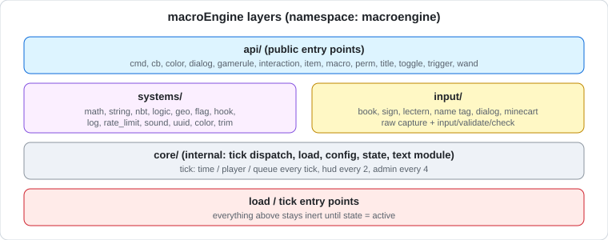

# macroEngine (v26.4-snapshot-1)

**macroEngine** is a macro/module framework datapack for Minecraft Java Edition, providing a large library of reusable command-based systems (math, string, NBT, geo, permissions, UUID cache, hooks, rate limiting, and more) plus a multi-source text/value input system (dialogs, books, signs, lecterns, name tags, command block minecarts).

> Maintained by: [vortacraftmc](https://github.com/vortacraftmc) — repository [`vortacraftmc/core`](https://github.com/vortacraftmc/core), path `packs/macroEngine-Datapack-v26.4`
> Former owner: Runtoolkit (`runtoolkit` organization and `runtoolkit/suite`, retired/archived; original source, not maintained)
> Minecraft: **26.4-snapshot-1** (`pack_format` / `min_format`–`max_format` **122**)
> 
> License: Unlicense
> 
> Namespace: `macroengine`
> 
> Maintainer: [vortacraftmc](https://github.com/vortacraftmc)

---

## Features



- **API layer** (`api/`) — stable public entry points: `cmd`, `cb` (callback queue), `color`, `dialog`, `gamerule`, `interaction`, `item`, `macro`, `perm`, `title`, `toggle`, `trigger`, `wand`
- **Systems layer** (`systems/`) — internal utility modules: `math`, `string`, `nbt`, `logic`, `geo`, `flag`, `hook`, `log`, `rate_limit`, `sound`, `uuid`, `color`
- **Input system** (`input/`) — capture player-provided values via writable book, sign, lectern, name tag, dialog, or command block minecart, with shared validation (`input/validate`) for int/float/bool/tag-safe strings
- **Toggle system** — per-module runtime enable/disable for `cb`, `perm`, `geo`, `wand`, `interaction`, `hook`, and `experimental` features
- **Rate limiting** — global, per-player, and per-channel request throttling
- **Hook system** — bind functions to fire on events such as block break, dimension change, and advancement grant
- **Item modifiers** (`item_modifier/`) — reusable `item_modifier` definitions for enchanting, glint, lore, tooltip, and rename operations
- **Advancement-driven triggers** (`advancement/`) — core, hidden, and system advancements used to drive internal logic and hooks
- **Experimental namespace** — gated behind `toggle/experimental`, for features not yet considered stable
- **Enchantments** (`enchantment/`) — `steady_hand`, `xp_thrift`, plus `momentum_surge` (movement speed on boots) and `overload_ward` (protection against macroEngine's own `overload`/`purge`/`sanctioned` damage types, grouped under `#macroengine:core` in `tags/damage_type/`)
- **Armor trim** (`trim_pattern/`, `trim_material/`) — custom `macroengine:circuit` pattern and `macroengine:overload` material (1.21.5+ registry shape: no `template_item`/`ingredient`, `override_armor_assets` only). Applied via any vanilla smithing template + the crafted trim ingot (`recipe/util/overload_trim_ingot.json`). Matching resource pack assets (overlay textures, color palette, `armor_trims.json` atlas extension via `replace:false`) ship in the companion resource pack
- **Trim processing** (`systems/trim/`) — example module that scans an entity's armor for the circuit+overload trim and fires a `macroengine:trim_matched` hook event per matching slot; `on_matched_example.mcfunction` shows a handler you can bind with `systems/hook/bind`. This fills the gap where the pack previously only had validation helpers (`input/validate/`) but no processing logic for the trim registries
- **Command conditions and nested groups** (`api/cmd/other/multi_cmd/`) — queue entries accept a `condition` object with boolean composition (`all_of`, `any_of`, `not`, nestable to depth 8) and a `commands` list that expands in place, so a group can be gated as a unit. Leaves: `tag`, `score` (target and bounds now optional), `predicate`, `entity`, `storage` (existence), and `data` (numeric range). Every leaf fails closed — a missing required key or an unreadable path reports *not passed* rather than silently passing
- **Deterministic RNG** (`systems/rng/`) — `seed`, `state`, `next`, `int`, `chance`, `pick`. Seeding makes randomised behaviour reproducible, which the previous generator could not do: it kept an undocumented `_rng_state` key with no way to set it. `systems/math/random` is now a thin wrapper over `systems/rng/int`, so there is one generator rather than two
- **Text-component rendering** (`systems/text/`) — helpers for NBT-backed components. On 26.1+ a `{"storage":...,"nbt":...}` component renders a string *with its quotes* and a number or boolean *with vanilla colouring* unless `interpret` and `plain` are both set. Every such component in this pack now sets both explicitly; `scripts/fix_text_components.py` at the repository root enforces it

---

## Requirements

- Minecraft Java Edition **26.4-snapshot-1**
- Datapack `min_format`/`max_format`: **122**

---

## Installation

1. Place the datapack folder in your world's `datapacks/` directory (or load it via a server-side pack source).
2. Run `/reload` or restart the server.
3. macroEngine initializes automatically via `#macroengine:events/on_load`.

To check the default tick configuration, see `data/macroengine/function/config/`.

---

## Usage

Most functionality is exposed through the `api/` namespace, e.g.:

```mcfunction
function macroengine:api/cmd/actionbar
function macroengine:api/dialog/show
function macroengine:api/perm/grant
function macroengine:api/wand/give
```

Internal systems under `systems/` are used by API functions and are not intended to be called directly by end users, though they remain accessible for advanced/custom integrations.

Example — scan a player for the circuit/overload trim and react to matches:

```mcfunction
data modify storage macroengine:input event set value "macroengine:trim_matched"
data modify storage macroengine:input func set value "macroengine:systems/trim/on_matched_example"
function macroengine:systems/hook/bind with storage macroengine:input {]

execute as @a run function macroengine:systems/trim/scan
```

---

## Notes

- This is the 26.4-snapshot-1 build of macroEngine, derived from the 26.3 pack of the archived `runtoolkit/suite` monorepo (`packs/macroEngine-Datapack-v26.3`). Development continues in `vortacraftmc/core`; do not file issues or PRs against `runtoolkit/*`.
- Experimental features are opt-in via `api/toggle/experimental/true` and are not guaranteed stable between versions.

---

## FAQ

> This section is based on a **static review** of the source (the code was read, not run in-game). Test on a staging server before deploying to production.

### Is it safe?

**Short answer:** no malicious content was found, but it is not safe to install blindly either. It is a powerful toolkit and can be dangerous if misused.

- **What is not in the pack:** the zip contains no `.jar`, `.exe`, scripts, `.git/` or `.env` files, only datapack files (`.mcfunction`, `.json`, `pack.png`). A datapack cannot open network connections or write to the server's file system on its own.
- **The real risk is the command-executing APIs.** Several functions run a caller-supplied string as a command (the `$execute ... run $(cmd)` pattern: `api/cmd/as_player`, `api/cmd/other/run_*`, `api/perm/run`, `api/perm/exec`, `core/lib/queue_add_cmd`, `core/lib/schedule_cmd`). Passing player-controlled text (sign, book, dialog, name tag) into them results in **command injection**. `api/cmd/op`, `ban_ip`, `whitelist` and `publish` also run server administration commands through macros.
- **The input system does not execute input.** Captured raw text is only written to the `macroengine:input` storage. Validate it with `input/validate/check` (`int`, `float`, `bool`, `tag_safe`) before using it.
- **There is no built-in protection.** The pack has no load gate or caller authorization. Any other datapack in the same world can call these functions (there is no isolation between datapacks).
- **Permission level:** everything runs at the server's function permission level.

### Can I install it on a server?

Yes. It is a purely server-side datapack, and players do not need any mods. Requirements:

1. **Version:** the pack targets `26.4-snapshot-1` (pack format `122`).
2. **Text rendering:** use it together with `macroEngine-Resourcepack-v26.4`.
3. **Back up first** and try it on a test server.
4. **Removal:** `/function macroengine:disable`. See the forceload note under Known Issues.

### Is it paid?

No. The pack is released under the **Unlicense** (public domain): free, including commercial use, and no attribution is required. Two notes:

- The header of `data/minecraft/tags/function/_rt_origin.mcfunction` inside the zip says "MIT License". Both licenses permit free use, but the two statements are inconsistent.
- This is not legal advice.

### Is it still maintained?

Not currently. The maintainer is stepping away and plans to return in 2027-2028, at which point changes will come as a pull request. Until then do not expect fixes; fork it and patch it yourself if you need changes.

### How is the performance?

Not measured. From the code: while players are online, the `time`, `player` and `queue` systems run **every tick**, `hud` every 2 ticks and `admin` every 4 ticks. `player_systems` also runs NBT-filtered `execute as @e` / `kill @e` scans over all `item` entities every tick, so cost grows with the number of dropped items. Systems you do not use can be turned off with `systems/flag/toggle_system`.

### Screenshots and demos

<!--
In-game media is not included yet. Add real captures under docs/media/ and uncomment:


-->

The diagrams above are generated from the source code. Real in-game captures (input capture, armor trim) are not available yet.

## Known Issues

- **Unmaintained until 2027-2028.** No security or compatibility patches will follow before then.
- **Snapshot-only target.** `26.4-snapshot-1`, pack format `122`. It may not load on stable releases.
- **Forceload side effects.** On load the pack runs `forceload add 0 0` and `forceload add -30000000 1600`. Cleanup only runs `forceload remove 0 0`, which also removes a `0 0` forceload the server owner added themselves, and `-30000000 1600` is **never removed** (if it lies outside the world border, the command may fail silently).
- **Command-executing APIs do not check who is calling.** See "Is it safe?".
- **NBT-filtered `@e[type=item]` scan every tick** (performance note above).
- **License and file inconsistencies.** `LICENSE` and `THIRD_PARTY_LICENSES.md` are not in this zip (the statement "Both files ship inside the distributed zip" above is wrong). `_rt_origin.mcfunction` is claimed to be stripped from distribution zips but is present (the game ignores it, so it is harmless) and its license header contradicts the Unlicense.
- **The restart hint depends on the file name.** After `disable`, the suggested command assumes `file/macroEngine-Datapack-v26.4.zip`; if the zip is named differently (e.g. `v26_4`), the command will not work.

## License

- macroEngine original code: Unlicense (public domain) — see [`LICENSE`](LICENSE).
- String module (`core/lib/string`, `core/internal/text`): macroEngine original code. Earlier releases used a module derived from CMDred's StringLib (MIT); see [`THIRD_PARTY_LICENSES.md`](THIRD_PARTY_LICENSES.md).

Both files ship inside the distributed zip.
